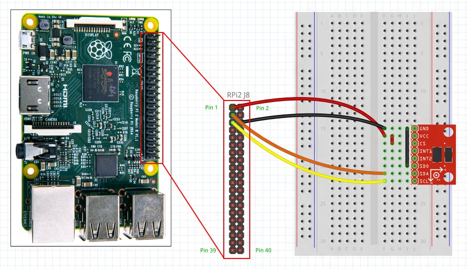
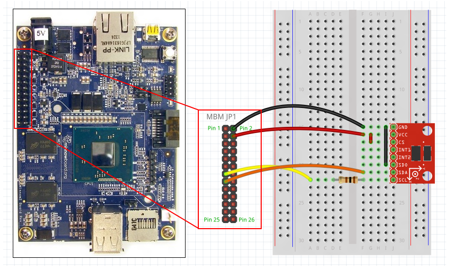
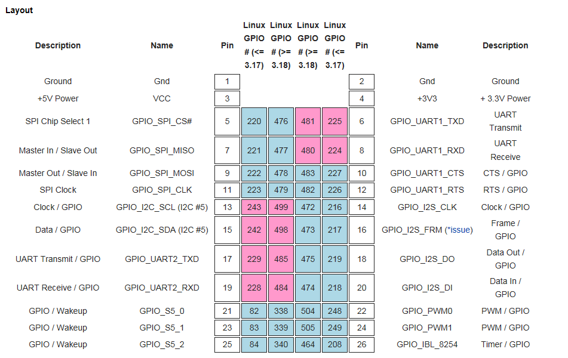

# ADXL345 센서 라즈베리파이와 Minnowboard Max 에 포팅하기 

본 소스는 https://github.com/Microsoft/Windows-driver-samples/blob/master/sensors/ADXL345Acc/readme.md 의 경로의 소스를 사용함 

## ADXL345 드라이버 소스 주요 내용 
Inf 파일 주요 값 

Class = Sensor
ClassGuid= {5175D334-C371-4806-B3BA-71FD53C9258D}

; DisplayName       Section          DeviceId
; -----------       -------          --------
%ADXL345Acc_DevDesc% = ADXL345Acc_Inst, ACPI\ADXL345Acc

ACPI\ADXL345Acc => ACPI 엔트리 

ADXL345AccDriverCopy = 12,UMDF

MediaDescription         = "ADXL345 accelerometer sample Driver"
MSFT                     = "Microsoft"
ADXL345Acc_DevDesc       = "ADXL345 accelerometer sample

드라이버 소스 주요 내용 

스텝 1 
DriverEntry(DriverObject) 

       //WDF 속성 설정 
	WDF_DRIVER_CONFIG DriverConfig;
	DriverConfig.DriverPoolTag = SENSORV2_POOL_TAG_ACCELEROMETER;
	//WDF 이벤트 등록, OnDeviceAdd 는 ADXL 클래스의 재정의된 함수 호출로 대체  
	WDF_DRIVER_CONFIG_INIT(&DriverConfig, ADXL345AccDevice::OnDeviceAdd);
	DriverConfig.EvtDriverUnload = OnDriverUnload;
	//WDF 메소드를 이용하여 드라이버 객체 생성 
	NTSTATUS Status = WdfDriverCreate(DriverObject, RegistryPath,
	                      WDF_NO_OBJECT_ATTRIBUTES, &DriverConfig, WDF_NO_HANDLE);

스탭 2 
OnDeviceAdd(DriverObject, DeviceInfo)  

	: 드라이버 특성 설정, PnP 등록, 큐와 관련된 객체 생성 ( timer, workitem, lock 등 ) 
	: 디바이스 Context 할당
	: Bottom Layer 코드 준비 
	//정적 속성 설정, pAccDeviceInit 는 OnDeviceAdd 의 두번째 변수 
	WdfDeviceInitSetPowerPolicyOwnership(pAccDeviceInit, true);
	//센서로 등록할 FdoAttributes 객체 선언 
	WDF_OBJECT_ATTRIBUTES FdoAttributes;
	WDF_OBJECT_ATTRIBUTES_INIT(&FdoAttributes);
	//FDO ( functional device object ) 를 센서 객체로 사용할 준비 
	NTSTATUS Status = SensorsCxDeviceInitConfig(pAccDeviceInit, &FdoAttributes, 0);
	//Bottom 코드 등록 
	WDF_PNPPOWER_EVENT_CALLBACKS pnpPowerCallbacks;
	WDF_PNPPOWER_EVENT_CALLBACKS_INIT(&pnpPowerCallbacks);
	pnpPowerCallbacks.EvtDevicePrepareHardware = 
	                                  ADXL345AccDevice::OnPrepareHardware;
	pnpPowerCallbacks.EvtDeviceReleaseHardware = 
	                                   ADXL345AccDevice::OnReleaseHardware;
	pnpPowerCallbacks.EvtDeviceD0Entry = ADXL345AccDevice::OnD0Entry;
	pnpPowerCallbacks.EvtDeviceD0Exit = ADXL345AccDevice::OnD0Exit;
	//등록한 코드를 WDF 의 콜백으로 등록 
	WdfDeviceInitSetPnpPowerEventCallbacks(pAccDeviceInit, &pnpPowerCallbacks);
	//디바이스 생성 
	Status = WdfDeviceCreate(&pAccDeviceInit, &FdoAttributes, &Device);
	
	//Context 설정은 OnPrepareHardware 에서 함 
	//큐 등록은 OnPrepareHardware 에서 함 
	
	//센서 드라이버이기 때문에 어플리케이션과 동작할 Sonsor CLX 를 등록해야 한다. 
	… 
	
SSDT ( ACPI Secondary System Description Table ) 
	Inf 파일에 정의된 HID 의 디바이스 엔트리를 실행하기 위해 등록 
	하드웨어 설정 (I2C, GPIO… ) 

OnDeviceAdd 에 정의된 PnP 관련 함수 ( OnPrepareHardware, D0Entry… ) 정의하기 

OnPrepareHardware (Device, ResourceList( ResourcesRaw, ResourcesTranslated) ) 

	: I2C 나 GPIO 등의 하드웨어 연결 
	: IO 커넥션을 얻고, 디바이스 경로로 해석, IoTarget 객체를 생성하고, IO 를 연결함 
	: WdfIoTargetCreate(Device);   => Device 는 ADXL345 클래스의 WDFDEVICE 
	: WdfIoTargetOpen(Context->IoTarget, i2c_path ) 
	
	//WDF 객체생성 
	PADXL345AccDevice pAccDevice = nullptr;
	WDF_OBJECT_ATTRIBUTES sensorAttributes;
	WDF_OBJECT_ATTRIBUTES_INIT_CONTEXT_TYPE(&sensorAttributes, ADXL345AccDevice);
	//센서 인스턴스를 clx 에 등록, Device 는 OnDeviceAdd 에서 생성된 WDFDEVICE 객체 
	SENSOROBJECT SensorInstance = NULL;
	NTSTATUS Status = SensorsCxSensorCreate(Device, &sensorAttributes, &SensorInstance)
	//OnDeviceAdd 에서 행해져야할 Context 설정 
	pAccDevice = GetADXL345AccContextFromSensorInstance(SensorInstance);
	// 진짜 하드웨어 센서 디바이스 초기화 ( ADXL345AccDevice::Initialize ) 호출
		ADXL345AccDevice::Initialize 
		: InitSensorCollection 를 호출하여 속성의 메모리 확보 (WdfMemoryCreate) 
		: 확보된 메모리에 ADXL345 헤더파일의 정보를 채움 
	pAccDevice->Initialize(Device, SensorInstance);
	
	
	
	// 채워진 속성으로 센서 초기화 
	Status = SensorsCxSensorInitialize(SensorInstance, &SensorConfig); 
	Status = pAccDevice->ConfigureIoTarget(ResourcesRaw, ResourcesTranslated);
		//ACPI 로 하드웨어 리소스를 얻고 IO 설정 
		ULONG ResourceCount = WdfCmResourceListGetCount(ResourcesTranslated);
		for (ULONG i = 0; i < ResourceCount; i++)
		    {
		        DescriptorRaw = WdfCmResourceListGetDescriptor(ResourcesRaw, i);
		        Descriptor = WdfCmResourceListGetDescriptor(ResourcesTranslated, i);
		        switch (Descriptor->Type) 
		        {
		            // Check we have I2C bus assigned in ACPI
		            case CmResourceTypeConnection:
			    case CmResourceTypeInterrupt:
				OnInterruptIsr : ADXL345_INT_SOURCE 의 인터럽트 소스를 읽어 와서,
				                     WdfInterruptQueueWorkItemForIsr 로 큐 생성 (ISR) 
				OnInterruptWorkItem : IST, pAccDevice->GetData()를 호출하여 
				                     ADXL345 의 데이터 버버 읽어옴 
				WdfInterruptCreate : 로 인터럽트 생성 마무리 
			}
		     }
		//m_Device = WDFDEVICE, m_I2CIoTarget = WDFIOTARGET 
		Status = WdfIoTargetCreate(m_Device, WDF_NO_OBJECT_ATTRIBUTES, &m_I2CIoTarget); 
		//I2C 리소스 연결 
		Status = WdfIoTargetOpen(m_I2CIoTarget, &OpenParams);

D0Entry 
	.. Status = pAccDevice->PowerOn(); 호출 
	PowerOn() 
		g_ConfigurationSettings[] 디바이스 레지스터 설정 배열 
		//배열을 I2C 를 이용하여 레지스터 설정 
		for (DWORD i = 0; i < ARRAYSIZE(g_ConfigurationSettings); i++)
		    {
		        REGISTER_SETTING setting = g_ConfigurationSettings[i];
		        Status = I2CSensorWriteRegister(m_I2CIoTarget, setting.Register, 
					&setting.Value, sizeof(setting.Value));
		    }
		 
		
I2C Read/Write 
PADXL345AccDevice pAccDevice = GetADXL345AccContextFromSensorInstance(SensorInstance);

I2CSensorWriteRegister
I2CSensorReadRegister 

## 라즈베리파이에 포팅하기 

라즈베리파이와 ADXL345 연결도 

라즈베리파이용 ASL 

DefinitionBlock ("ACPITABL.dat", "SSDT", 1, "MSFT", "ADXL345", 1)
{
   Device(ADXL)
   {
	Name(_HID, "ADXL345Acc")
	Name(_UID, 1)
	
	Method(_CRS, 0x0, NotSerialized)
	{
		Name(RBUF, ResourceTemplate()
		{          
			I2CSerialBus(0x53, ControllerInitiated, 400000, AddressingMode7Bit, "\\_SB.I2C1", , ) 
			GpioInt(Edge, ActiveHigh, Exclusive, PullDown, 0, "\\_SB.GPI0",,,,) {0x04}
		})
		Return(RBUF)
	}
   }
}

GPIO4 번핀사용

ASL 을 ADXL345Acc.asl 로 저장 후 ( Block 정의 문에 기존 ADXL345Acc 를 ADXL345 로만 바꿈 => 긴 path 로 에러나기 때문 ) 
CMD 를 관리자 권한 으로 열고 C:\Program Files (x86)\Windows Kits\10\Tools\x86\ACPIVerify 에서 asl adxl345acc.asl 입력 시 ACPITABL.dat 로 출력 됨 

라즈베리를 켜고 FTP 로 Windows\system32 폴더에 adxl345acc.dll, inf 와 ACPITABL.dat 를 복사 
파워쉘에서 
  PS C:\> cd C:\Windows\System32
    devcon dp_add ADXL345Acc.inf 
설치 후 
    shutdown /r /t 0 
으로 재부팅 
   devcon status acpi\ADXL345Acc 
로 드라이버 확인 

## Minnowboard에 연결하기 

Minnowboard ADXL345 연결도 

SDA -> 15 핀 I2C Data 
SCL -> 13 핀 I2c Clock 
GND -> 2핀 GND 
VCC-> 4핀3.3V 
CS -> 4핀 3.3V
INT1 -> 21핀 GPIO_S5_0 
INT2-> 

Device(ADXL)
{
	Name(_HID, "ADXL345Acc")
	Name(_UID, 1)
	
	Method(_CRS, 0x0, NotSerialized)
	{
		Name(RBUF, ResourceTemplate()
		{          
			I2CSerialBus(0x53, ControllerInitiated, 400000, AddressingMode7Bit, "\\_SB.I2C6", , ) 
			GpioInt(Edge, ActiveHigh, Exclusive, PullDown, 0, "\\_SB.GPO2",,,,) {0x00}
		})
		Return(RBUF)
	}
}

